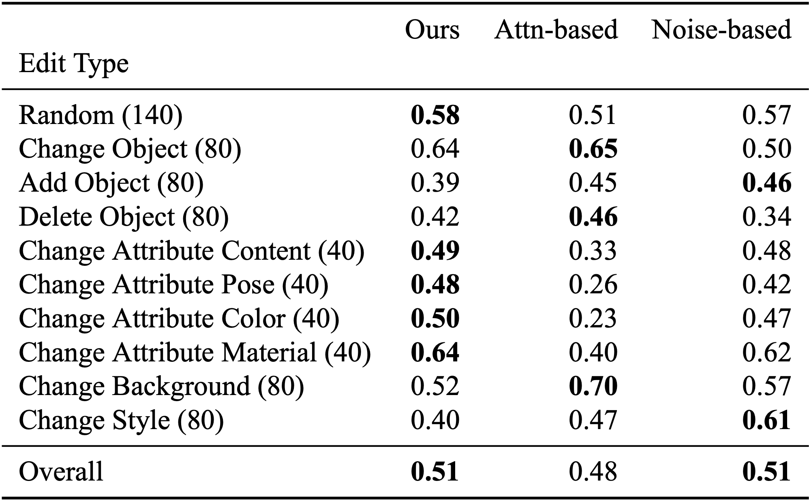
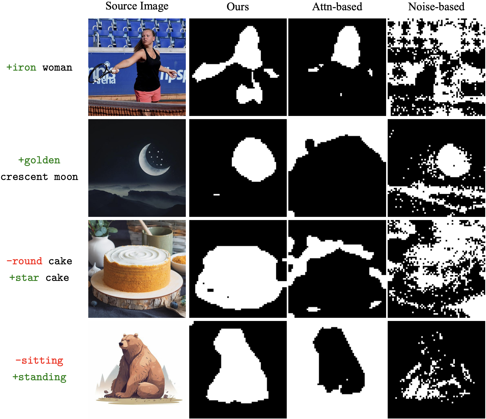
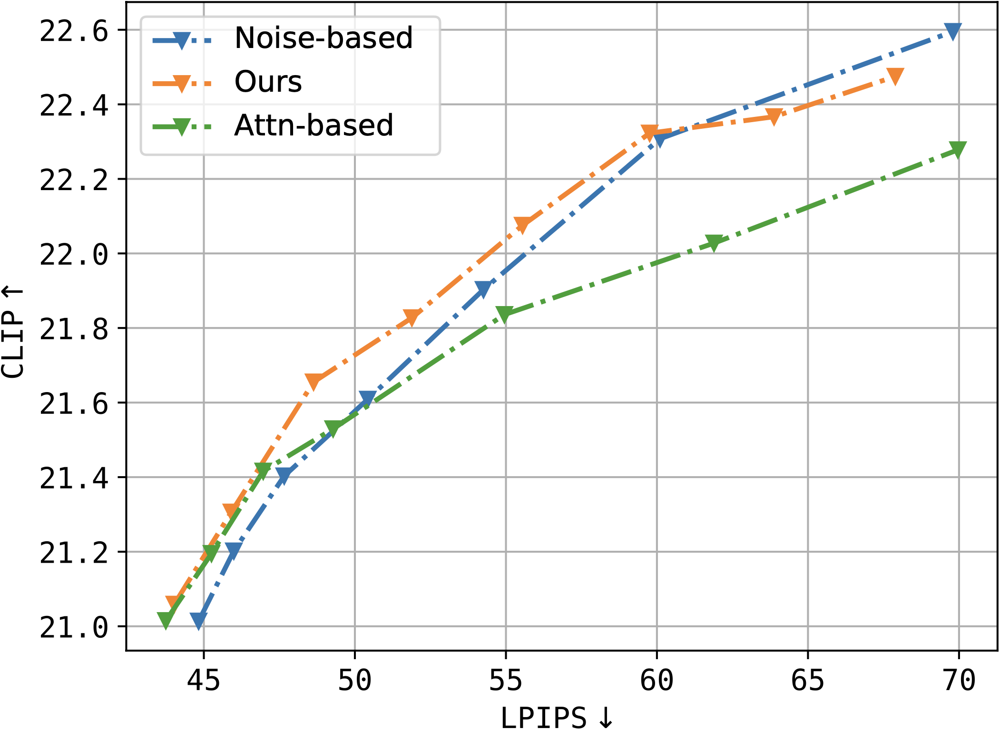
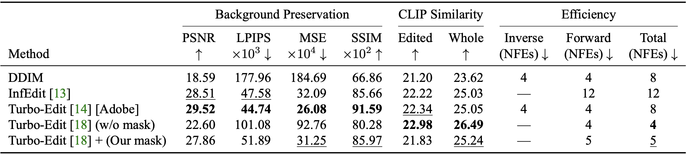

# Image Editing Mask

This repository contains implementations of different techniques to obtain a binary mask of the object that supposted to be edited using only a target diffusion model ([SDXL-Turbo](https://huggingface.co/stabilityai/sdxl-turbo) in our case).

We observe 3 types of such techniques (the only existing ones for our knownledge):
- Noise-based technique (see for example [Diffedit](https://arxiv.org/abs/2210.11427))
- Attention-based technique (see for example [Prompt-to-prompt](https://arxiv.org/abs/2208.01626))
- Our proposed tecnhique

## Usage

### Installation

One should use this code as a python module. So please firstly install it via
```bash
pip install .
```

After this you can import the module with name `image_editing_mask`.

It comes with [Turbo-Edit](https://arxiv.org/abs/2408.00735)'s original implementation with a small modification which includes a feature of using a binary mask of the object to be edited. Please also make sure to check out the original repository: <https://github.com/GiilDe/turbo-edit>.

### Image Editing

To edit an arbitrary image one can use the `EditingPipeline` class which uses Turbo-Edit along with one of the mask generation techniques under the hood. There are 3 options for mask generation: `ours`, `attn_based` and `noise_based`. The first two methods share the same binarization technique and their meaningful binarization threshold lies in the range from 0 to 1. The `noise_based` method's meaningful binarization threshold lies in the range from 0 to ~10 (as we use the same binarization method as in Diffedit, check the [link](https://github.com/huggingface/diffusers/blob/v0.33.1/src/diffusers/pipelines/stable_diffusion_diffedit/pipeline_stable_diffusion_diffedit.py#L1046)). Varying `num_repeat`, `strength`, `seed` and `sample_mode` also could be helpful.

```python
import os
os.environ["CUDA_VISIBLE_DEVICES"] = "1" # this is needed to set device, otherwise it always uses 0'th (turbo-edit's limitation)

from PIL import Image
from image_editing_mask.editing import EditingPipeline

cache_dir = "/HF/cache/dir" # or None

pipeline = EditingPipeline(cache_dir)
image = Image.open("/path/to/image.png")

result = pipeline.edit(
    image,
    source_prompt = "a face",
    target_prompt = "a face with glasses",
    mask_obtaining = "ours", # or "attn_based" and "noise_based"
    binarization_threshold = 0.5,
    num_repeat = 1, # the more the value, the more stable the resulting object's mask
    strength = 0.5, # in [0.25, 0.5, 0.75]
    sample_mode = "argmax", # or "sample"
    seed = 8128,
)
```

To obtain just a mask of an object to be edited one can use
```python
import random

from diffusers import AutoPipelineForImage2Image
from image_editing_mask.ours import get_map_ours
from image_editing_mask.attn_based import get_map_attn_based
from image_editing_mask.noise_based import get_map_noise_based
from image_editing_mask.patcher import NoiseAttentionPatcher


pipe = AutoPipelineForImage2Image.from_pretrained(
    "stabilityai/sdxl-turbo",
    torch_dtype=torch.float16,
    variant="fp16",
    cache_dir="/hf/cache/dir",
).to("device")

patcher = NoiseAttentionPatcher()
patcher.patch_attention(pipe.unet, patch_cross=True, patch_self=False)
patcher.patch_call(pipe)

image = Image.open("/path/to/image.png")

func = random.choice([get_map_ours, get_map_attn_based, get_map_noise_based])
mask = func(
    pipe,
    patcher,
    image,
    "a face",
    "a face with glasses",
    num_repeat=1,
    strength=0.5,
    sample_mode="argmax"
)
```

### Scripts for Pie-Bench

There are scripts to inferece all 3 techniques on [Pie-Bench](https://arxiv.org/abs/2310.01506) dataset as on a segmentation task and as on an editing task (in this case along with Turbo-Edit). To run these scripts one can do

```bash
python scripts/parse_pie.py --ds-path /path/to/pie/bench # parse dataset
python scripts/generate_masks_pie.py --cache-dir /hf/cache/dir --device cuda:1 # generate masks using all methods
CUDA_VISIBLE_DEVICES=1 python scripts/edit_pie.py --mode one --cache-dir /hf/cache/dir # edit images using all masks
python scripts/calculate_editing_metrics.py --device cuda:1
python scripts/calculate_segmentation_metrics.py 
```

The script that calculates image editing metrics uses the original implementation of them from the authors of the Pie-Bench dataset. Please make sure to check out their [paper](https://arxiv.org/abs/2310.01506) and [code](https://github.com/cure-lab/PnPInversion).

## Binary Segmentation Quality

Here is the Dice metric of different techniques on Pie-Bench dataset. The best metric across all different tasks is highlighted using bold font.



Some examples of segmentation of an object to be edited depending on given prompts:




## Image Editing Quality

Here is the graph of CLIP Similarity score (inside the target mask) and LPIPS score (outside the target mask) of different techniques to obtain a  mask PLUS Turbo-Edit. The more the graph is shifted left and upward, the better.



Some examples of editing from Pie-Bench.


The table showing comparison of our method + Turbo-Edit with other existing fast image editin methods. The other ones are [InfEdit](https://arxiv.org/abs/2312.04965) and [Turbo-Edit from Adobe](https://arxiv.org/abs/2408.08332) (NOT the one we used).


